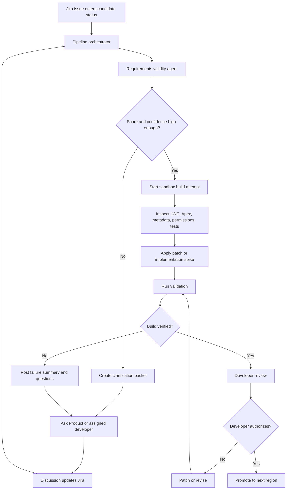
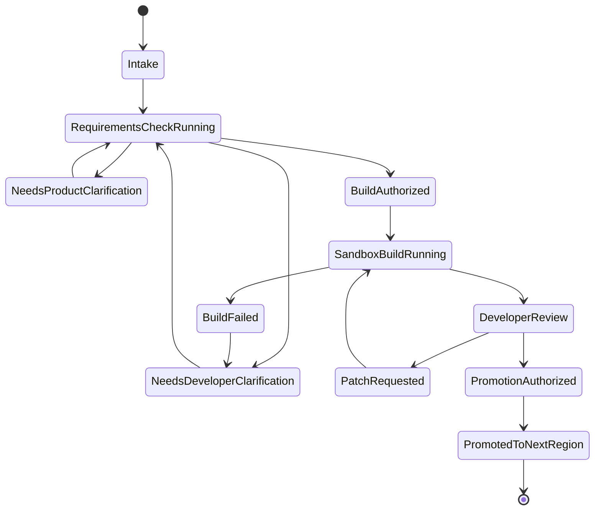
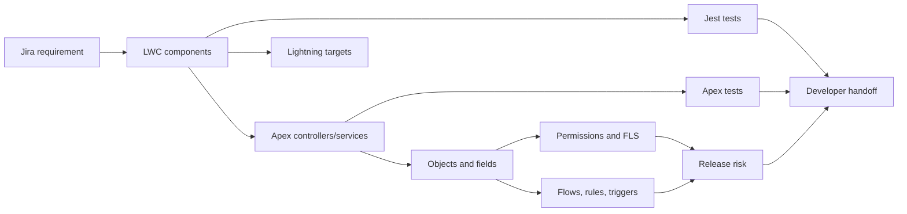

# Workflow Diagrams

## Confidence-Gated Delivery Flow

```mermaid
flowchart TD
  A["Jira issue enters candidate status"] --> B["Pipeline orchestrator"]
  B --> C["Requirements validity agent"]
  C --> D{"Score and confidence high enough?"}
  D -->|"No"| E["Create clarification packet"]
  E --> F["Ask Product or assigned developer"]
  F --> G["Discussion updates Jira"]
  G --> B
  D -->|"Yes"| H["Start sandbox build attempt"]
  H --> I["Inspect LWC, Apex, metadata, permissions, tests"]
  I --> J["Apply patch or implementation spike"]
  J --> K["Run validation"]
  K --> L{"Build verified?"}
  L -->|"No"| M["Post failure summary and questions"]
  M --> F
  L -->|"Yes"| N["Developer review"]
  N --> O{"Developer authorizes?"}
  O -->|"No"| P["Patch or revise"]
  P --> K
  O -->|"Yes"| Q["Promote to next region"]
```

## State Machine

```mermaid
stateDiagram-v2
  [*] --> Intake
  Intake --> RequirementsCheckRunning
  RequirementsCheckRunning --> NeedsProductClarification
  RequirementsCheckRunning --> NeedsDeveloperClarification
  RequirementsCheckRunning --> BuildAuthorized
  NeedsProductClarification --> RequirementsCheckRunning
  NeedsDeveloperClarification --> RequirementsCheckRunning
  BuildAuthorized --> SandboxBuildRunning
  SandboxBuildRunning --> BuildFailed
  SandboxBuildRunning --> DeveloperReview
  BuildFailed --> NeedsDeveloperClarification
  DeveloperReview --> PatchRequested
  PatchRequested --> SandboxBuildRunning
  DeveloperReview --> PromotionAuthorized
  PromotionAuthorized --> PromotedToNextRegion
  PromotedToNextRegion --> [*]
```

## Implementation Impact Map

```mermaid
flowchart LR
  A["Jira requirement"] --> B["LWC components"]
  B --> C["Apex controllers/services"]
  B --> D["Lightning targets"]
  C --> E["Objects and fields"]
  E --> F["Permissions and FLS"]
  E --> G["Flows, rules, triggers"]
  B --> H["Jest tests"]
  C --> I["Apex tests"]
  F --> J["Release risk"]
  G --> J
  H --> K["Developer handoff"]
  I --> K
  J --> K
```
